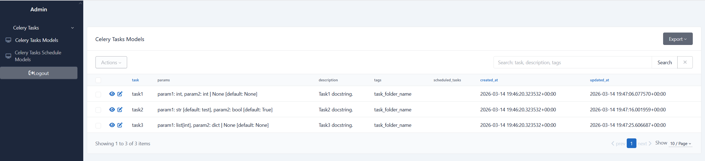
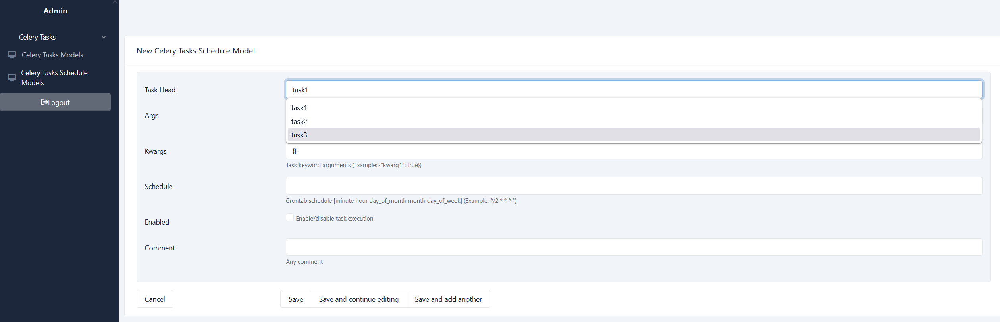
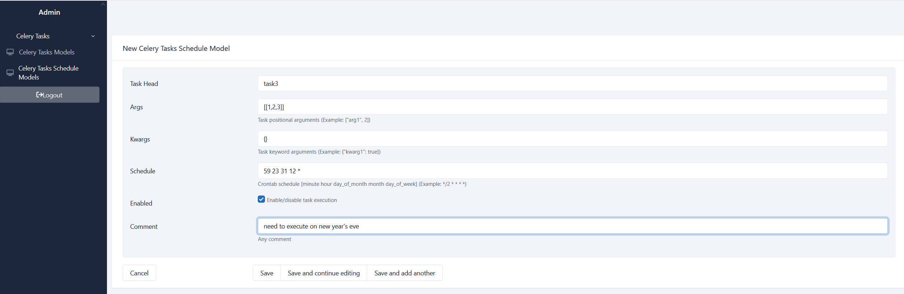

### About

This package enables you to store crontab periodic celery tasks in an SQLAlchemy compatible database. 
It was specifically developed to manage the periodic tasks from [sqladmin](https://pypi.org/project/sqladmin/) admin interface for SQLAlchemy, 
but in theory any other solution can be used.

NOTE: the package was developed and tested with a PostgreSQL backend.

Inspired by [django-celery-beat](https://pypi.org/project/django-celery-beat/)

### Installation

Install from PyPi:

`$ pip install celery-beat-sqlalchemy`

### Configuration
1. Set `beat_db_scheduler_dsn` conf variable in your celery application:
    ```
    from celery import Celery
    
    celery_app = Celery(__name__)
    celery_app.conf.beat_db_scheduler_dsn = <DB_DSN>  # must be synchronous
    ```
2. In case you use [sqladmin](https://pypi.org/project/sqladmin/), add `CeleryTasksAdmin` and `CeleryTasksScheduleAdmin` models to admin panel:
   ```
   from celery_beat_sqlalchemy.admin import CeleryTasksAdmin, CeleryTasksScheduleAdmin
   
   <YOUR_ADMIN_APP>.add_view(CeleryTasksAdmin)
   <YOUR_ADMIN_APP>.add_view(CeleryTasksScheduleAdmin)
   ```
3. Start celery worker:  
   ```
   $ celery -A <YOUR_APP> worker -l info
   ```
4. Start celery beat with `DatabaseScheduler` as scheduler:
   ```
   $ celery -A <YOUR_APP> beat -S celery_beat_sqlalchemy.scheduler:DatabaseScheduler -l info
   ```
### Usage
The following examples are for [sqladmin](https://pypi.org/project/sqladmin/) interface.
#### View application available tasks
Your application up-to-date list of tasks can be seen in `Celery Tasks Models` view. New tasks are downloaded on the application start automatically, as well as the removed ones are deleted:

#### Add new periodic task
To add a new scheduled task you select it from the dropdown list:

and fill in all necessary arguments and the desired schedule:


### Implementation details
#### Models
* `CeleryTasksModel`  
This model represents a task in your application. When downloaded during startup, tasks' arguments and docstrings are parsed for more detailed view in an admin interface. 
* `CeleryTasksScheduleModel`  
This model defines a single periodic task to be run. The same task can be run with different args/kwargs, and they are different entries for celery beat. To uniquely identify those entries the combination of task_name-args-kwargs is used as a unique constraint in the table.
* `CeleryTasksScheduleMetaModel`  
Keeps time when celery_tasks_schedule table was last updated and serves as a signal to reload the schedule from the database.
#### Schedule
To change the schedule of a task, just update the corresponding db entry. The next time the `DatabaseScheduler` synchronizes, it will acknowledge the new schedule.

NOTE: synchronization is done in the middle of a minute (between 20th and 50th seconds) to avoid overriding the current heap. The main reason of this implementation is to "save" rare tasks from sudden elimination from the schedule because of the reload.

Other synchronization rules:
* On each reload the scheduler is filled with enabled db entries
* Reload is done after any update in `CeleryTasksScheduleModel` or every 5 minutes if there are no update events
* New scheduled task in code, that is not in db: new db entry is created automatically
* Scheduled task in code as well as in db: schedule in db is used to run task
* Tasks that are deleted in code will be removed from db after redeploy